# AGRI-SCAN AI | THE SMART PLANT DOCTOR

> **Competition entry:** Website & AI Innovation Contest 2026

> **Category:** Track A - Foundation Track

> **Status:** In development

<p align="center">
<a href="./LICENSE">

</a>


</p>

## Quick Links
* **Website:** [agri-scan-ai](https://agriscan.duckdns.org/) 
* **Source Code:** [GitHub](https://github.com/MITOM06/AGRI-SCAN-AI-ASA-)
* **Dataset:** [Rice Leaf Diseases Detection - Kaggle](https://www.kaggle.com/datasets/loki4514/rice-leaf-diseases-detection)
* **Split data (Train/Val/Test):** [Google Drive](https://drive.google.com/drive/folders/1Ebmeq0fpYecxsK6QEL-sqtjTGGQbUFB6?usp=sharing)

## Table of Contents 
* [I. Project Overview](#i-project-overview)
* [II. Product Features](#ii-product-features)
* [III. AI Solutions](#iii-ai-solutions)
* [IV. System Architecture & Technology](#iv-system-architecture--technology)
* [V. Current Limitations & Roadmap](#v-current-limitations--roadmap)
* [VI. Installation Guide](#vi-installation-guide)
* [VII. Project Management & OSS](#vii-project-management--oss)
* [VIII. Database Design](#viii-database-design)

## I. PROJECT OVERVIEW

### 1.1. Introduction
**Agri-Scan AI** is a multi-platform system (Web & Mobile App) that applies artificial intelligence to help farmers and plant lovers manage crop health. The system acts as a "virtual agriculture assistant", enabling fast disease diagnosis and providing science-based care solutions.

### 1.2. Context & The Problem
Agriculture today faces many challenges:
* **Misidentification:** Farmers often confuse diseases with similar symptoms, leading to the wrong pesticide, waste, and pollution.
* **Slow access to information:** Waiting for an expert to visit the field takes a long time, allowing diseases to spread quickly.
* **No care roadmap:** Urban home-farmers often lack knowledge of proper fertilizing and watering routines.

### 1.3. The Solution
Agri-Scan AI provides a comprehensive set of solutions:
1. **AI Diagnosis:** Recognize plant diseases from instant photos with high accuracy.
2. **Smart Treatment:** Provide a detailed treatment plan (cause, handling, recommended fertilizer/pesticide).
3. **Care Roadmap:** Build a periodic care roadmap for each growth stage of the plant.
4. **Community Knowledge:** An open library of sustainable farming techniques.

### 1.4. Core Values
* **Accurate:** Leveraging the power of advanced Computer Vision models.
* **Timely:** Diagnose right in the field with just a smartphone.
* **Sustainable:** Prioritizing biological solutions and eco-friendly care routines.

### 1.5 Team Members

<table align="center">
  <tr>
    <td align="center" valign="top" width="160px">
      <a href="https://github.com/tapu25z">
        <br />
        <div style="height: 8px;"></div>
        <sub><b>Bùi Huỳnh Tây</b></sub>
      </a><br />
      <div style="height: 5px;"></div>
      <sub style="display: block; min-height: 30px; line-height: 1.2;"><b>Leader / AI Architect</b></sub>
    </td>
    <td align="center" valign="top" width="160px">
      <a href="https://github.com/thanhnhanqn77">
        <br />
        <div style="height: 8px;"></div>
        <sub><b>Hà Lê Thành Nhân</b></sub>
      </a><br />
      <div style="height: 5px;"></div>
      <sub style="display: block; min-height: 30px; line-height: 1.2;"><b>AI Engineer</b></sub>
    </td>
    <td align="center" valign="top" width="160px">
      <a href="https://github.com/MITOM06">
        <br />
        <div style="height: 8px;"></div>
        <sub><b>Trần Phúc Khang</b></sub>
      </a><br />
      <div style="height: 5px;"></div>
      <sub style="display: block; min-height: 30px; line-height: 1.2;"><b>Backend & DevOps</b></sub>
    </td>
    <td align="center" valign="top" width="160px">
      <a href="https://github.com/BangSonChau">
        <br />
        <div style="height: 8px;"></div>
        <sub><b>Châu Băng Sơn</b></sub>
      </a><br />
      <div style="height: 5px;"></div>
      <sub style="display: block; min-height: 30px; line-height: 1.2;"><b>Web Developer</b></sub>
    </td>
    <td align="center" valign="top" width="160px">
      <a href="https://github.com/Tung-pro123">
        <br />
        <div style="height: 8px;"></div>
        <sub><b>Lê Thanh Tùng</b></sub>
      </a><br />
      <div style="height: 5px;"></div>
      <sub style="display: block; min-height: 30px; line-height: 1.2;"><b>Mobile Developer</b></sub>
    </td>
  </tr>
</table>

| Member | Role | Key responsibilities | University |
| :--- | :--- | :--- | :--- |
| **Bùi Huỳnh Tây** | **Team Leader & AI Architect** | Project management, data engineering, AI architecture design, LLM deployment. | University of Information Technology - VNU-HCM |
| **Hà Lê Thành Nhân** | **AI Engineer** | Research & training of the Computer Vision model (ViT + MoE), dataset preprocessing. | FPT University |
| **Trần Phúc Khang** | **Backend & DevOps** | Core API development (NestJS), database design (MongoDB), Docker packaging & CI/CD. | FPT Aptech |
| **Châu Băng Sơn** | **UI/UX & Web Dev** | Figma UI design, admin dashboard & landing page development (React/NextJS). | FPT University |
| **Lê Thanh Tùng** | **Mobile App Dev** | Mobile app development (React Native), camera AI handling & data synchronization. | FPT University |

## II. Product Features

To meet the competition timeline and focus on the core AI-powered features (the highest-scoring criteria), the MVP (Minimum Viable Product) of Agri-Scan AI is strictly scoped as follows:

### 2.1. Core features that MUST be completed:
#### 2.1.1. **AI Chatbot:**
   * The user uploads or directly captures a photo of a diseased leaf/stem.
   * The system processes the image and returns the result: disease name, confidence (%).
   * Save diagnosis sessions and chat history with the AI so the user can track the plant's progress.

<p align="center">
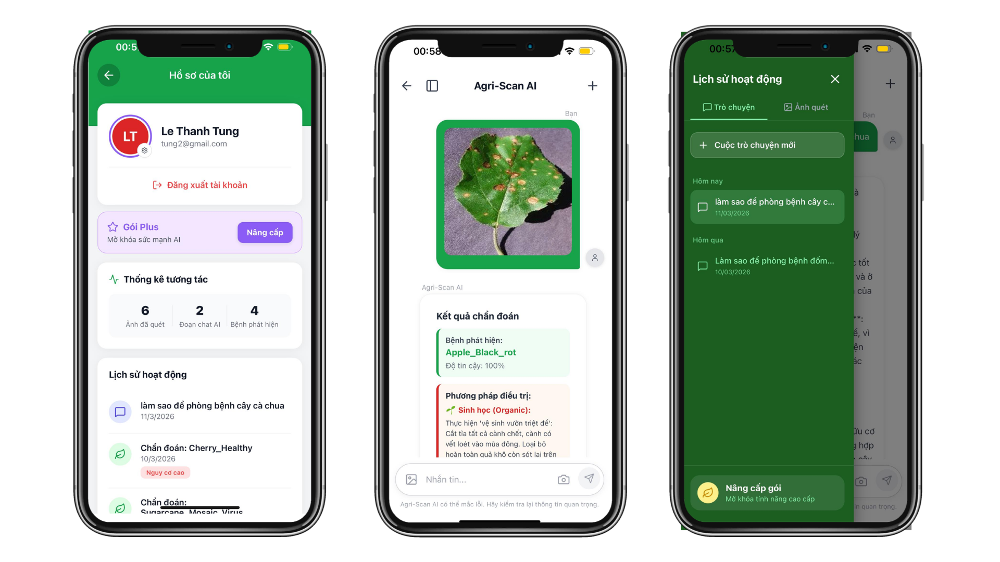
</p>

#### 2.1.2. **Plant Wiki:**
* In-depth data: detailed information on the biological characteristics, habitat, and typical diseases of plant species grown in Vietnam.
* Smart filters: let users quickly categorize by plant type (fruit trees, industrial crops, ornamentals...), growth rate, and light/water needs.
* Integrated disease info: each species comes with a list of common fungi, bacteria, and pests, giving users an overview before planting.

<p align="center">
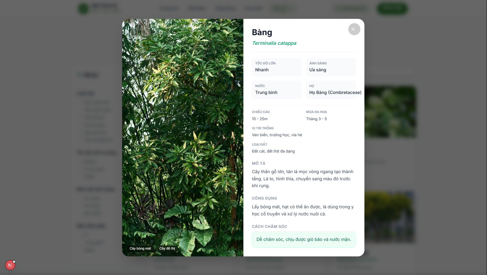
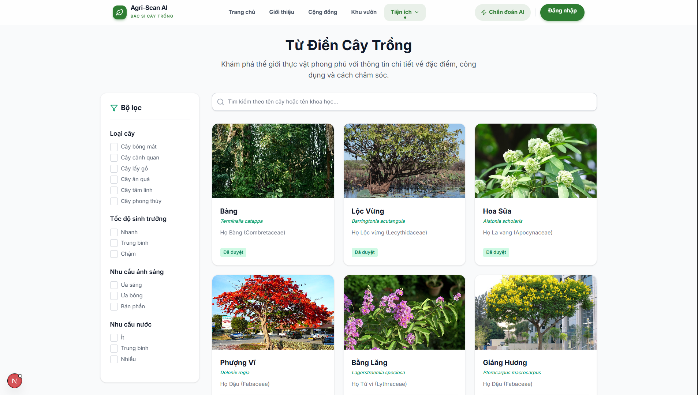
</p>

#### 2.1.3. **My Garden:**
- Growth-tracking dashboard: shows the plant's development roadmap through each stage (Seedling -> Growth -> Flowering -> Fruiting -> Harvest).
- Ideal-metric analysis: information on the most suitable soil moisture, light, nutrients, and fruit-set rate for each specific plant being grown.
- Diagnosis & Solutions (Smart Diagnosis):
   * Automatically shows details of the disease just recognized by the AI Chatbot.
   * Recommends in-depth care tips: for example, water stress, high-potassium fertilizing, or artificial pollination techniques to boost yield.
   * Suggests a step-by-step recovery roadmap for a diseased plant.
<p align="center">
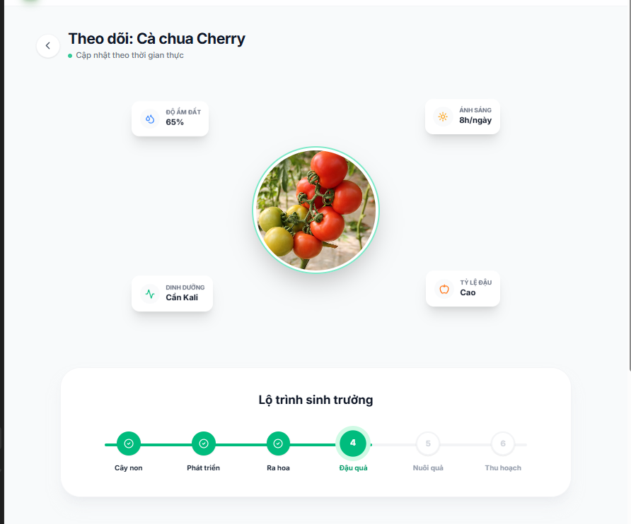
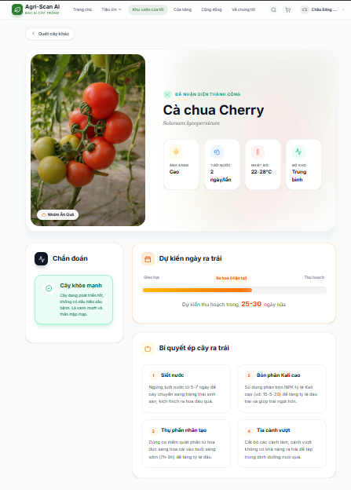
</p>

#### 2.1.4. **Weather:**
* Risk Alert: automatically warns about heat shock or large day-night temperature swings (>15°C), helping farmers proactively prevent plant stress.
* Detailed 24h & 8-day forecast: shows temperature, humidity, wind speed, and UV index in real time at the user's location.
* Plant-doctor recommendations: based on the weather (e.g. high humidity), the system gives suitable farming advice such as: "Limit organic fertilizing in humid, muggy weather to avoid fungal disease".
<p align="center">
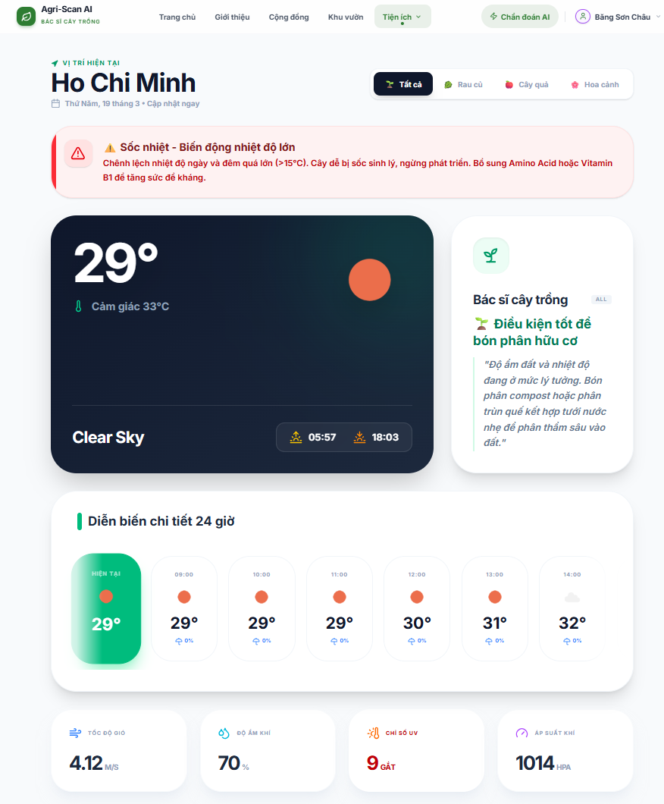
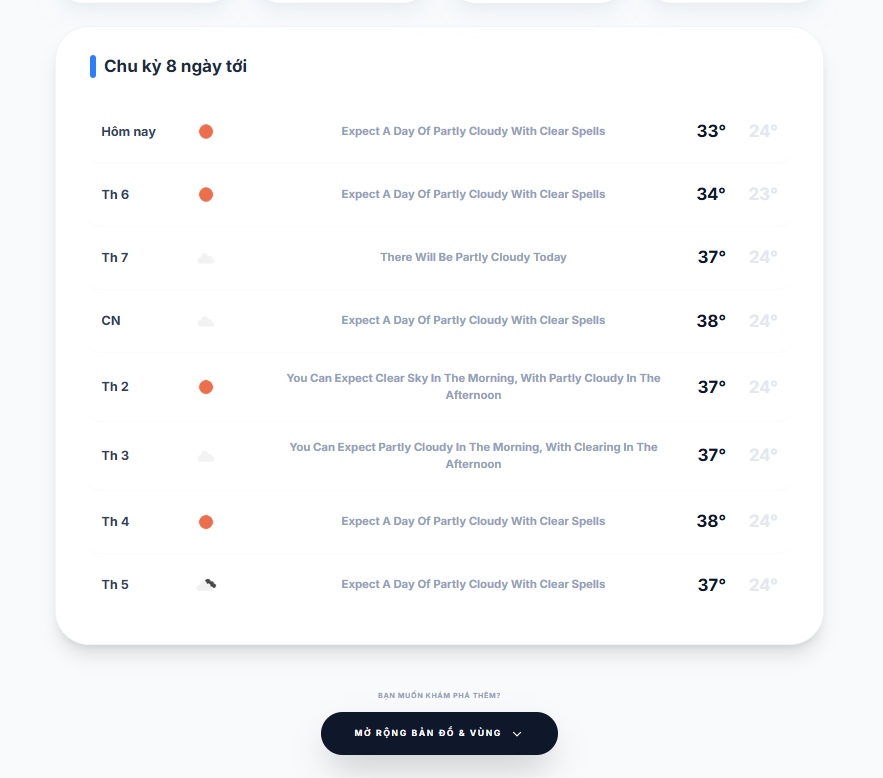
</p>

#### 2.1.5. **Agriculture Shop:**
* An e-commerce marketplace for agricultural supplies: product list, product detail, cart, ordering, and order management (`/shop`, `/shop/cart`, `/shop/checkout`, `/shop/orders`).
* Integrated payment/plan-upgrade flow (`/payment`, `/upgrade`).

#### 2.1.6. **Community:**
* A space for users to share farming knowledge & experience (`/community`).

### 2.2. Out of scope / expansion directions:
* *Full social network:* No nested comments, follow, or complex personalized feed yet — the community is currently at a basic sharing level.
* *Real (production) payments:* The payment flow is at a demo/basic-integration level, not yet connected to an official commercial payment gateway.

> **Note:** Compared to the original MVP plan (AI-only focus), the project has expanded to add the **Shop** and **Community**. See the business model & roadmap in [`docs/ROADMAP.md`](docs/ROADMAP.md).

### 2.3 Differentiators (to be updated)

---

## III. AI SOLUTIONS

The system applies advanced techniques in Machine Learning and Natural Language Processing (NLP) to create a digital "plant doctor" with superior accuracy.

### 3.1. Core Backbone
Agri-Scan AI is built on a modern deep neural network combining a **Vision Transformer (ViT)** and a **Mixture of Experts (MoE)** mechanism.
* **Transformer Encoder:** Splits the image into "patches", helping the model understand spatial context and the relationships between diseased regions on the rice leaf.
* **Mixture of Experts (MoE):** Uses a smart gating network to route data to specialized "Experts", accurately distinguishing diseases with similar symptoms.
* **Regularization:** Applies Orthogonal, Entropy, and Usage Regularization techniques to optimize the performance and diversity of the Experts.

### 3.2. Training Data 
The model is trained on a real-world image dataset from [rice-leaf-diseases-detection](https://www.kaggle.com/datasets/loki4514/rice-leaf-diseases-detection), including healthy rice leaves and the most common diseases. The system can accurately classify the following **9 classes**:


| No. | Disease | Class Name | Sample image | Train | Val | Test | Identifying features |
| :--: | :--- | :--- | :---: | :---: | :---: | :---: | :--- |
| 1 | **Bacterial Leaf Blight** | Bacterial Leaf Blight | 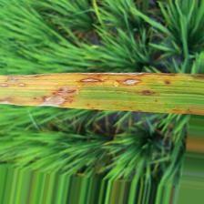 | 957 | 119 | 121 | Long pale-yellow/white streaks along the leaf margins |
| 2 | **Brown Spot** | Brown Spot | 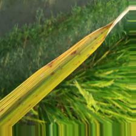 | 1229 | 153 | 155 | Small scattered round/oval brown spots |
| 3 | **Leaf Blast** | Leaf Blast | 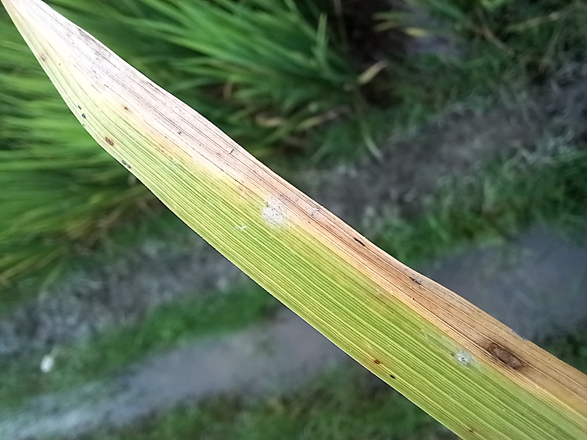 | 1370 | 171 | 172 | Diamond-shaped lesions with a gray-white center and dark brown border |
| 4 | **Leaf Scald** | Leaf Scald | 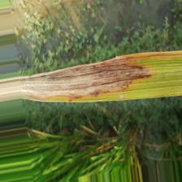 | 1065 | 133 | 134 | Blotchy scald spreading from the leaf tip, with wavy bands |
| 5 | **Narrow Brown Spot** | Narrow Brown | 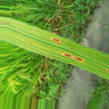 | 763 | 95 | 96 | Narrow, thin, long brown spots parallel to the leaf veins |
| 6 | **Neck Blast** | Neck Blast | 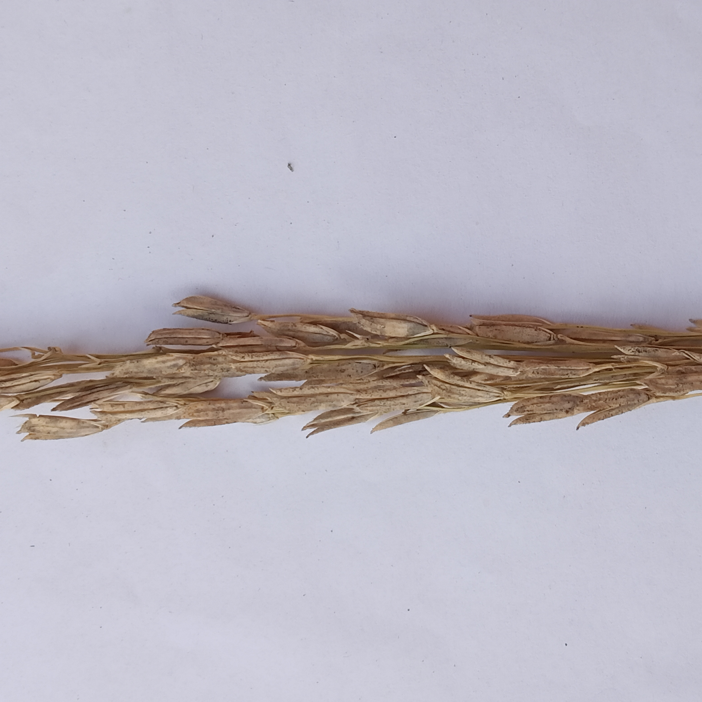 | 800 | 100 | 100 | Constriction at the panicle neck, causing empty grains or lodging |
| 7 | **Rice Hispa** | Rice Hispa | 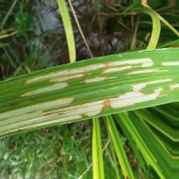 | 1039 | 129 | 131 | Long white streaks left as feeding trails by the insect |
| 8 | **Sheath Blight** | Sheath Blight | 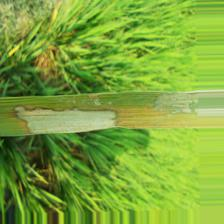 | 1300 | 162 | 163 | Tiger-stripe blotches on the leaf sheath near the water line |
| 9 | **Healthy Rice Leaf** | Healthy Rice Leaf | 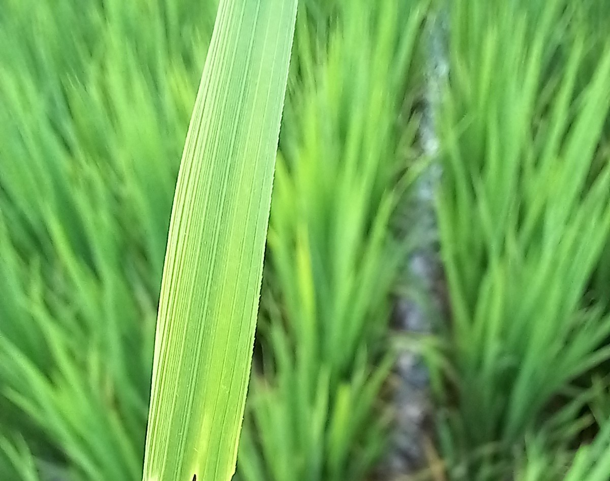 | 865 | 108 | 109 | Lush green leaf with no signs of damage |
| | **TOTAL** | | | **9,388** | **1,170** | **1,181** | **Total: 11,739 files** |

### 3.3. Main API Endpoints
The project provides 3 independent API services, ensuring scalability and flexible integration:

#### 3.3.1. Vision Model - Disease Classification (`/predict`)
* **Function:** Diagnose the disease status from an image.
* **Technology:** ViT + MoE backbone.
* **Input/Output:** Takes an image file (jpg, png) and returns the disease label with a confidence score.

#### 3.3.2. LLM Model - Technical Assistant (`/chat`)
* **Function:** Advise on farming techniques and plant care.
* **Technology:** An LLM (gemini-3-flash-preview) combined with **RAG (Retrieval-Augmented Generation)**.
* **Highlight:** Retrieves data from a trusted agricultural knowledge base, helping the chatbot give accurate answers and minimize AI "hallucination".

#### 3.3.3. My Garden Solution (`/my_garden`)
* **Function:** Provide a detailed treatment plan after diagnosis.
* **Output:** Guidance on pesticide use, fertilizer adjustment, and a specific watering routine for each disease.

### 3.4. AI System Architecture 
The data-processing pipeline is designed end-to-end to optimize the user experience:
1.  **Preprocessing:** Input images are resized, normalized, and augmented (during training) to make the model more robust.
2.  **Inference:** ViT-MoE extracts features and produces the classification result.
3.  **Response optimization:** The diagnosis result is fed into the RAG system so the LLM (Gemini) generates a personalized care calendar.

<p align="center">
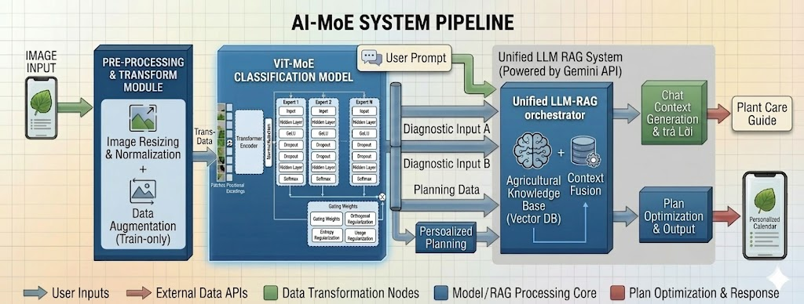
</p>

### 3.5. Experimental Results 
Based on the test report, the model achieves extremely impressive performance with an **Overall Accuracy of 99.49%**.

| Disease class | Accuracy (%) | Test samples |
| :--- | :--- | :--- |
| **Bacterial Leaf Blight** | 97.52% | 118/121 |
| **Brown Spot** | 100.00% | 155/155 |
| **Healthy Rice Leaf** | 100.00% | 109/109 |
| **Leaf Blast** | 98.26% | 169/172 |
| **Leaf Scald** | 100.00% | 134/134 |
| **Neck Blast** | 100.00% | 100/100 |
| **Rice Hispa** | 100.00% | 131/131 |
| **Sheath Blight** | 100.00% | 163/163 |

The data has been split into 3 train/val/test sets: at [data_splited](https://drive.google.com/drive/folders/1Ebmeq0fpYecxsK6QEL-sqtjTGGQbUFB6?usp=sharing)

---

## IV. SYSTEM ARCHITECTURE & TECHNOLOGY 

### 4.1 Technologies used
The project adopts a **Monolithic** architecture to optimize development time and ease packaging, while keeping a clearly modular code structure for maintainability. The entire system uses **TypeScript** to ensure consistency.

#### 4.1.1 Backend system
* **Framework:** **NestJS (Node.js).** * *Reason:* A strict structure that makes it easy to split modules within a single monolithic block. Handles receiving image files from clients, calling third-party AI APIs, parsing results, and returning them.
* **Database:** **MongoDB.**
  * *Reason:* An extremely flexible NoSQL database for storing documents. Biological characteristics and disease symptoms are very diverse; MongoDB makes it easier to extend fields than SQL.
* **Caching:** **Redis.**
  * *Reason:* Speeds up responses and saves AI-API costs. Common disease-scan requests are cached to be returned instantly.

#### 4.1.2. Frontend system 
* **Mobile App (iOS & Android):** **React Native (with Expo).**
  * *Reason:* Write once, build for both iOS and Android. Fast UI development, easy Camera integration for capturing leaf photos.
* **Web Interface:** **React (Vite) or Next.js.**
  * *Reason:* Shares the React ecosystem with the mobile app, reusing logic/components. Builds the landing page and the admin data-management page.

#### 4.1.3. Infrastructure & Deployment 
* **Containerization:** **Docker & Docker Compose.**
  * The entire backend, MongoDB, and Redis are containerized. Spin up the environment quickly with just `docker-compose up -d`.
* **Cloud deployment (Hosting):**
  * Backend & Database: deployed to Google Cloud Platform (GCP).
  * Web Frontend: deployed via Vercel or Firebase Hosting.

### 4.2 System architecture
---


## V. Current Limitations & Roadmap

### 5.1 Limitations
See the "Technical debt" section in [`docs/ARCHITECTURE.md`](docs/ARCHITECTURE.md).

### 5.2 Development roadmap
Business model & detailed roadmap: [`docs/ROADMAP.md`](docs/ROADMAP.md).

---
## VI. Installation Guide

```bash
pnpm install                 # install the whole workspace (run from the repo root)

# Dev infrastructure (mongodb, redis, rabbitmq, ai-service, backend, web)
docker compose -f infra/docker-compose/docker-compose.yml up -d

# Run each app
pnpm dev:web                 # web (Next.js)
pnpm dev:mobile              # mobile (Expo)
pnpm --filter backend start:dev
# ai-service: cd apps/ai-service && uvicorn ai.main:app --reload

# Build (ALWAYS build packages first — backend/web depend on @agri-scan/*)
pnpm build
```

Architecture details: [`docs/ARCHITECTURE.md`](docs/ARCHITECTURE.md).

---

## VII. Project Management & OSS

Team workflow rules, Git workflow, and Conventional Commits standard: [`docs/CONTRIBUTING.md`](docs/CONTRIBUTING.md).

---

## VIII. DATABASE DESIGN

The project uses **MongoDB**, applying NoSQL design principles: minimize complex joins, prioritize read speed. The system tightly manages user usage quotas (rate limiting for AI scan & prompts).

### 8.1. Collection: `users`
Stores user information, authorization, and service-plan management.

```typescript
export declare class User {
    email: string;
    password: string;
    fullName: string;
    role: string;
    plan: string;
    planExpiresAt: Date | null;
    dailyImageCount: number;
    dailyPromptCount: number;
    lastResetDate: Date;
}
```

### 8.2. Collection: `plants`
Matches the botanical classification data, storing detailed growth parameters.

```typescript
export declare class Plant {
    commonName: string;
    scientificName: string;
    family: string;
    description: string;
    images: string[];
    uses: string;
    care: string;
    category: string[];
    growthRate: string;
    light: string;
    water: string;
    height: string;
    floweringTime: string;
    suitableLocation: string;
    soil: string;
    status: string;
    diseases: Disease[];
}
```

### 8.3. Collection: `diseases`
A detailed disease dictionary with causes and multi-method treatment plans.

```typescript
export declare class Disease {
    name: string;
    pathogen: string;
    type: string;
    symptoms: string[];
    treatments: Treatment;
    status: string;
}
```

### 8.4. Collection: `scan_histories` & `chat_histories`
Track the user's interactions with the AI system to monitor the plant's improvement.

```typescript
// History of disease recognition from images
declare class AIPrediction {
    diseaseId: Disease;
    confidence: number;
}

export declare class ScanHistory {
    userId: User;
    imageUrl: string;
    aiPredictions: AIPrediction[];
    isAccurate: boolean | null;
    scannedAt: Date;
}

// History of consultations with the AI assistant
export interface IChatMessage {
    role: 'user' | 'ai';
    content: string;
    timestamp: Date;
}

export declare class ChatHistory {
    userId: Types.ObjectId | User;
    title: string;
    messages: IChatMessage[];
}
```

---
